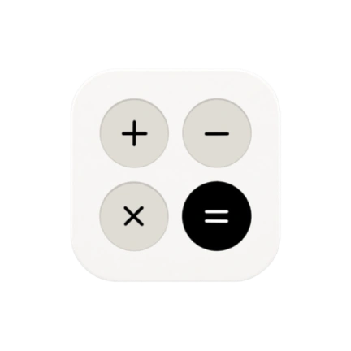

# PdfEditor+

<p align="center">
  
</p>

<p align="center">
  <b>100% Private, On-Device PDF & Image Manipulation for Android</b>
</p>

<p align="center">
  
  
  
  
  
</p>

---

## 🌟 Overview

**PdfEditor+** is a modern, fast, and privacy-focused Android application designed to perform essential PDF and image manipulation tasks entirely on your device. 

Unlike traditional PDF tools that require uploading sensitive documents to external cloud servers, **PdfEditor+ processes 100% of your data locally** using high-performance on-device libraries.

---

## ✨ Features & Tools

### 📄 PDF Manipulation
- **Merge PDF**: Combine multiple PDF files into a single organized document.
- **Split PDF**: Extract specific pages or page ranges from any PDF document.
- **Rotate PDF**: Rotate individual pages or whole documents (90°, 180°, 270°).
- **Rearrange Pages**: Visual drag-and-drop page reordering.
- **Page Numbers**: Automatically add customizable page numbering to documents.
- **Watermark**: Overlay custom branding or confidentiality stamps.
- **Electronic Signature**: Sign documents directly with a smooth vector signature pad.
- **Compress PDF**: Optimize and downscale document sizes for easy sharing.
- **Grayscale**: Convert color documents to clean black-and-white copies.
- **Protect / Unlock PDF**: Encrypt documents with passwords or remove password protections.
- **Metadata Editor**: View and edit PDF metadata properties (Author, Title, Subject, Keywords).

### 🖼️ Image & Conversion Tools
- **Image to PDF**: Convert JPG, PNG, and WebP images into clean PDFs.
- **PDF to Image**: Render and export PDF pages as high-resolution images.
- **Extract Images**: Extract all embedded original images from a PDF file.
- **PDF to Text**: On-device OCR text extraction using Google ML Kit.
- **Image Compressor**: Compress images with rotation and quality control.
- **Image Round Cropping**: Crop images into circular or custom-radius rounded rectangles with lossless or transparent WebP encoding.

---

## 🔒 Privacy & Architecture

- **Zero Cloud**: No files or metadata ever leave the device.
- **Instant & Offline**: Operates without an active internet connection.
- **Clean Architecture**: Built using Kotlin, Android Jetpack (Navigation, Room, DataStore, ViewModel, ViewBinding), and Coroutines.

---

## 🛠️ Tech Stack & Dependencies

- **Language**: [Kotlin](https://kotlinlang.org/)
- **UI & Design**: Material Design 3, Jetpack ViewBinding
- **PDF Engine**: [iText 7 Community](https://itextpdf.com/)
- **PDF Page Rendering**: [PdfiumAndroid](https://github.com/nicbell/PdfiumAndroid)
- **On-Device OCR**: [Google ML Kit Text Recognition](https://developers.google.com/ml-kit)
- **Image Loading**: [Coil](https://coil-kt.github.io/coil/)
- **Image Cropping**: [uCrop](https://github.com/Yalantis/uCrop)
- **Local Persistence**: [Room Database](https://developer.android.com/training/data-storage/room) & [DataStore Preferences](https://developer.android.com/topic/libraries/architecture/datastore)

---

## 🚀 Getting Started & Building

### Prerequisites
- Android Studio Ladybug | 2024.2.1 or newer
- JDK 17 or JDK 21
- Android SDK 35 (Min SDK 24)

### Clone & Build
```bash
# Clone the repository
git clone https://github.com/your-username/PdfEditorPlus.git
cd PdfEditorPlus

# Build debug APK
./gradlew assembleDebug

# Build release APK & AAB bundle (requires signing configuration)
./gradlew bundleRelease assembleRelease
```

---

## 📄 Privacy Policy
https://pixelcraftin.co.in/App%20Policy/pdf-policy
